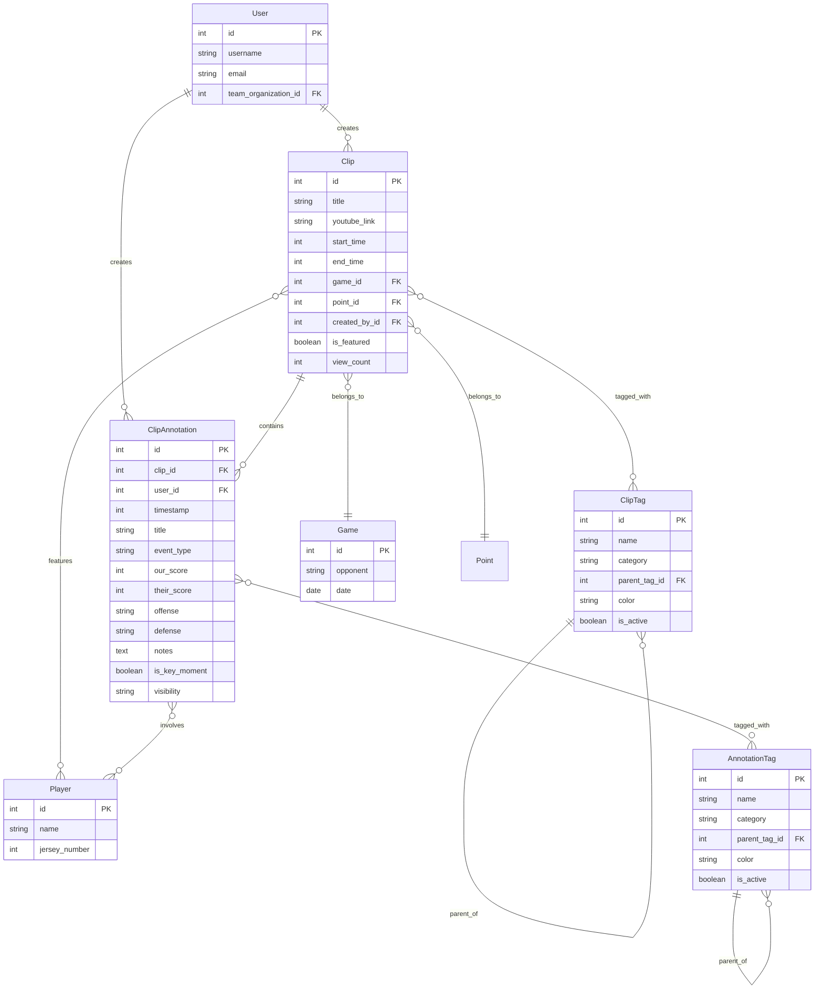
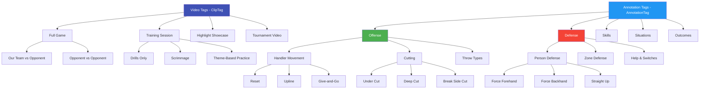
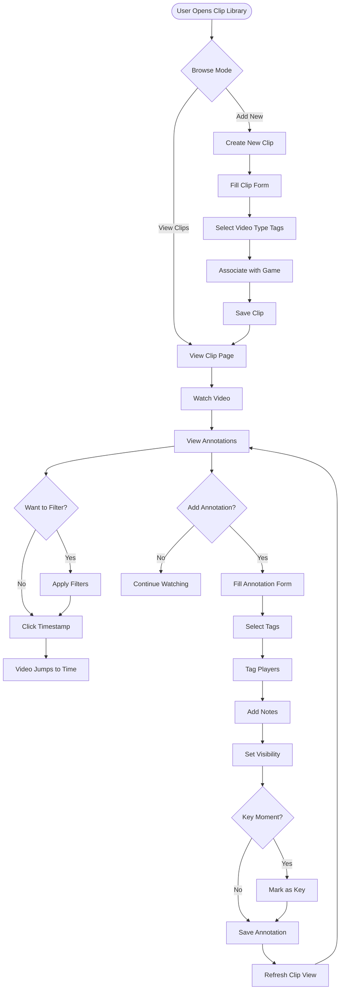
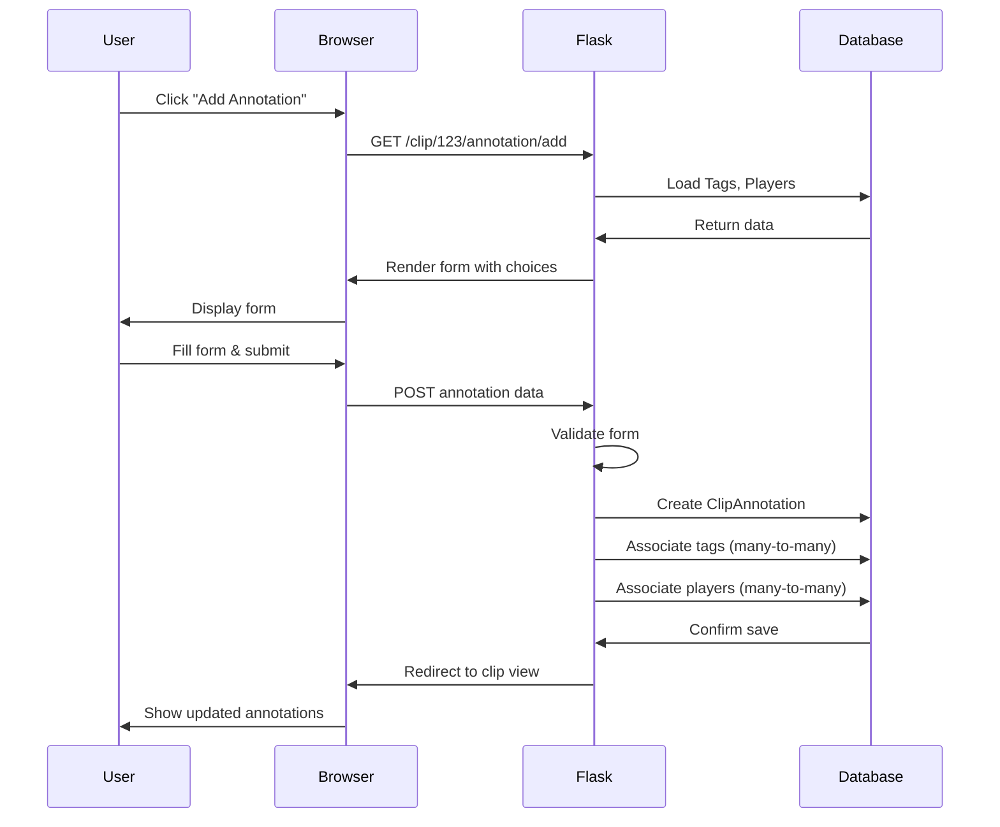
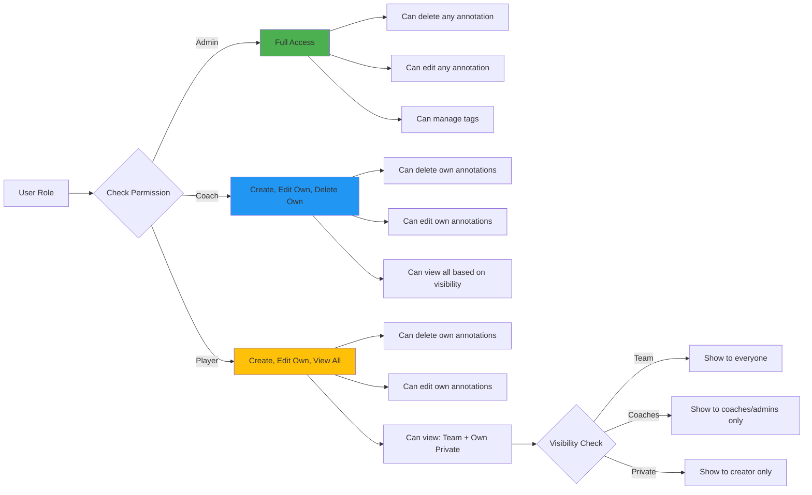
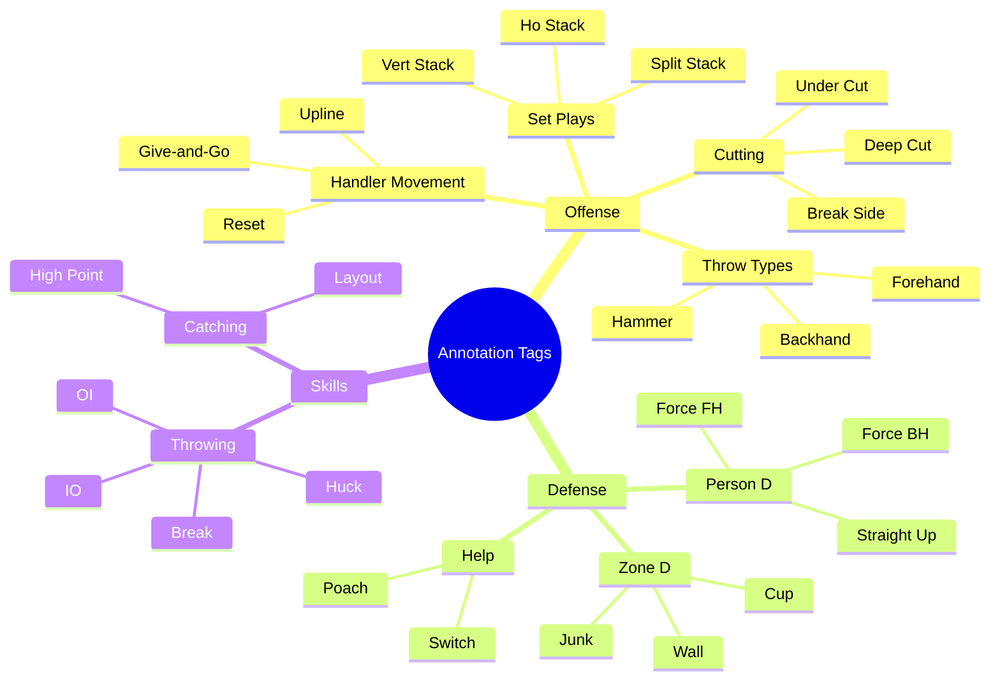
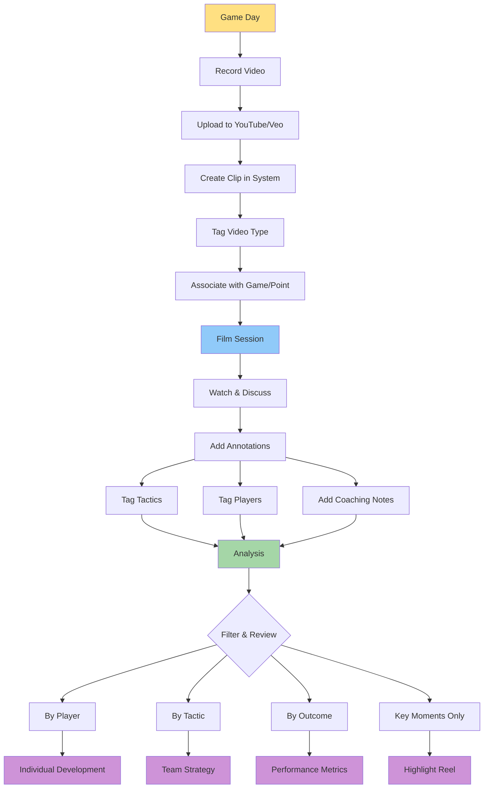
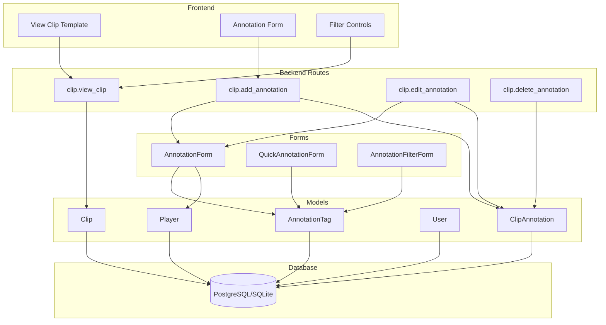

# System Architecture Diagrams

## Database Schema

## Tag Hierarchy Structure

## User Flow Diagram

## Annotation Creation Flow

## Permission Model

## Tag Organization Example

## Data Flow: From Upload to Analysis

## Component Interaction

---

## Key Relationships

### One-to-Many
- User → Clips (one user creates many clips)
- User → Annotations (one user creates many annotations)
- Clip → Annotations (one clip has many annotations)
- Game → Clips (one game has many clips)

### Many-to-Many
- Clip ↔ ClipTag (clips can have multiple video tags)
- Clip ↔ Player (clips can feature multiple players)
- Annotation ↔ AnnotationTag (annotations can have multiple tactical tags)
- Annotation ↔ Player (annotations can involve multiple players)

### Self-Referential
- ClipTag → ClipTag (hierarchical parent-child)
- AnnotationTag → AnnotationTag (hierarchical parent-child)

---

These diagrams can be viewed using any Mermaid renderer:
- GitHub (renders automatically)
- Mermaid Live Editor (https://mermaid.live)
- VS Code with Mermaid extension
- Many documentation platforms
